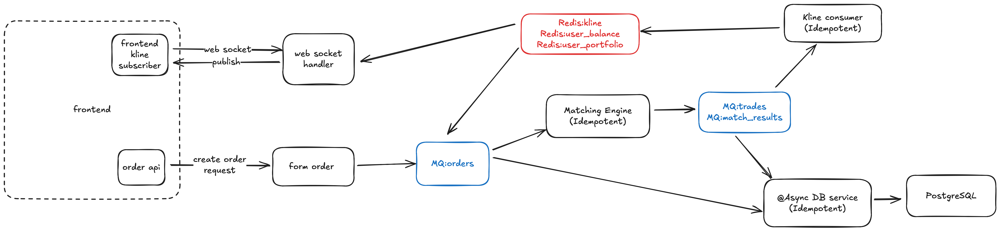
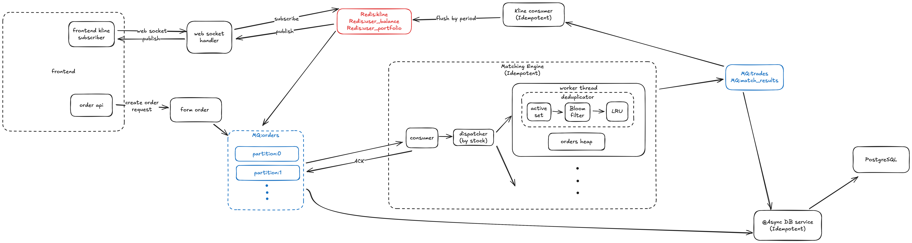

# StockArena

## Main architecture

## Detailed architecture

## Tech Stack
- Backend: Java 17+, Spring Boot (Web, WebSocket, Data JPA, Actuator)
- Messaging & Cache: Redis (Pub/Sub, caching)
- Database: PostgreSQL (transactional persistence, order/trade storage)
- Frontend: Vue 3 + Vite for real-time dashboards
- Containerization & Deployment: Docker, docker-compose
- Build Tooling: Maven

## Features & Modules
- API Layer (REST):
Provides endpoints for account management, order submission, queries, and trade history.
- WebSocket Service:
Real-time streaming of candlestick (K-line) data, order book depth, and trade events.
- Matching Engine:
  - Custom thread pool for efficient resource allocation
  - OrderBook implementation with price/time priority matching
  - Supports limit/market orders and extensible strategies
  - Multi-symbol concurrency with strict sequential processing per symbol
  - Caching Layer:
  Redis used for high-frequency data such as order book snapshots, top-N depth, and recent trades.
- Database Layer (Postgres):
Persistent storage of orders, trades, and account updates, optimized for batch writes.
- Deployment:
Docker Compose setup with app + Postgres + Redis + monitoring stack. Ready for CI pipelines (GitHub Actions / Jenkins).